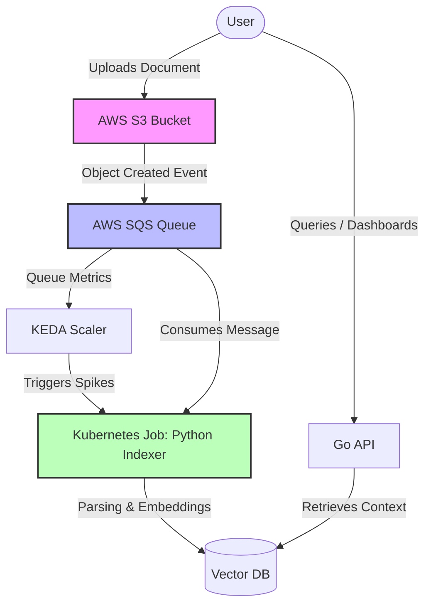

# Simple RAG Pipeline

A highly cost-efficient, production-ready document indexing and RAG (Retrieval-Augmented Generation) pipeline deployed on AWS. The project's architecture is strictly built around a Zero-Daemon policy: the indexing component never runs continuously. Instead, it is spun up as a short-lived Kubernetes Job only when real load is present, driving infrastructure costs down to the absolute minimum.

## Architecture

The system relies on an event-driven flow that automatically scales out based on the volume of incoming documents.



## Directory Structure

This repository is organized as a strict monorepo layout. Do not introduce alternative root-level folders:

```text
simple-rag/
├── apps/
│   ├── api/          # Lightweight Go-based API for frontend charts and querying
│   └── indexer/      # Python + Haystack pipeline (Short-lived Kube Job)
├── deploy/
│   └── k8s/          # Kubernetes manifests & KEDA ScaledObject configurations
├── docs/
│   └── adr/          # Architecture Decision Records log
└── terraform/
    ├── envs/prod/    # Environment entry point (invokes modules)
    └── modules/      # Reusable infrastructure (vpc, eks, iam_irsa, s3, sqs)
```

## Architecture Decision Records (ADR)

All key technical and infrastructural decisions in this repository are captured via ADRs (Architecture Decision Records). These logs live directly inside the codebase as Markdown files. This ensures our architecture is versioned alongside the source code and undergoes formal peer review during Pull Requests before any code is built.

To manage these architectural logs smoothly, we use the `adr-tools` CLI.

### How to Use Locally

Install the CLI tool:

```bash
# On macOS via Homebrew
brew install adr-tools
```

Initialize the repository (Already configured):
If setting up from scratch, the directory is mapped via `adr init docs/adr`.

Create a new architectural proposal:
To propose a significant technical change (e.g., choosing a specific VectorDB instance), run:

```bash
adr new "Selecting Vector Database for RAG Pipeline"
```

The tool will automatically generate a file named `docs/adr/0002-selecting-vector-database-for-rag-pipeline.md` with a clean boilerplate (Context, Decision, Consequences), set the timestamp, and assign it a Proposed status.

Superseding an older decision:
If a new decision changes or completely replaces a past design choice (e.g., decision #5 replaces decision #2):

```bash
adr new -supersedes 0002 "Migrating to Alternative VectorDB"
```

The CLI tool will automatically cross-reference both markdown files and update their metadata statuses instantly.
