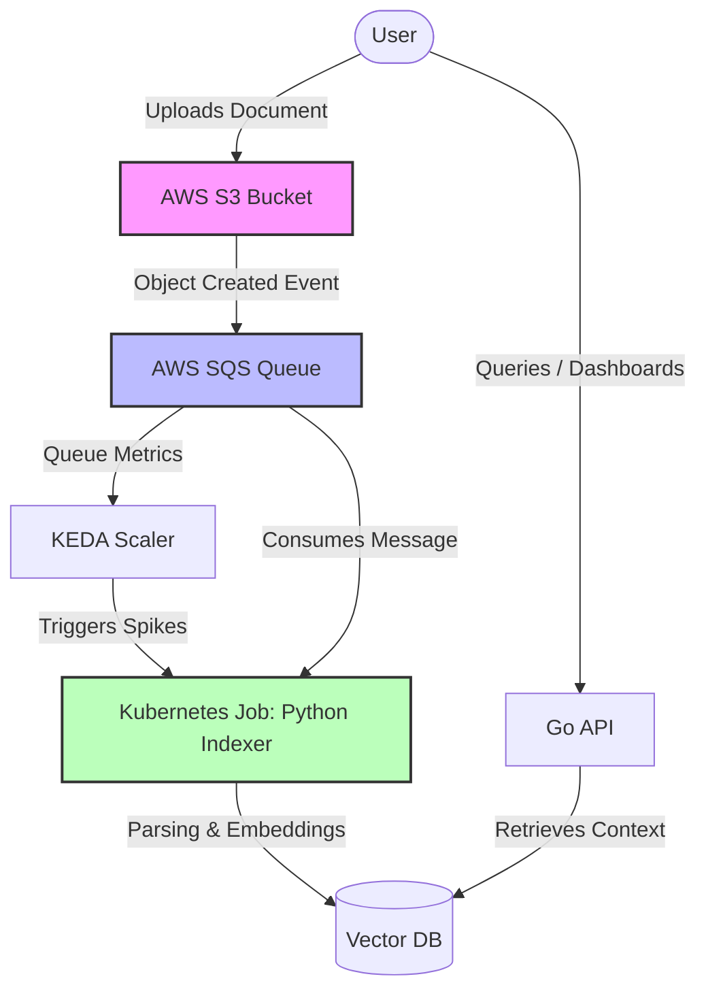

# 2. System Boundaries

Date: 2026-05-22

## Status

Draft

## Context

Our RAG (Retrieval-Augmented Generation) pipeline requires a clear separation of concerns between document ingestion/processing and user querying. We need an architecture that scales dynamically with ingestion spikes while maintaining a highly available, low-latency API for querying. 

We have chosen an event-driven flow for indexing and a synchronous API for querying. The key interactions and components are mapped out below:

## Decision

Decided to establish the following system boundaries:
1. **Data Ingestion Window (S3)**: S3 acts as the single, decoupled entry point for data. The pipeline does not expose write-APIs for ingestion; it relies solely on file-dropped events, isolating the core system from external upload traffic.

2. **Asynchronous Ingestion Boundary**: Handled via AWS SQS queue depth, decoupling ingestion from heavy indexing jobs.

3. **Processing Boundary**: A short-lived Kubernetes Job (Python Indexer) triggered by KEDA based on queue metrics. Implements a strict "Zero-Daemon" policy for compute infrastructure.

4. **Query Boundary**: A lightweight, always-on Go API interacting with the Vector DB for fast context retrieval.

5. **Network & Resource Isolation**: All internal RAG components must be deployed within a dedicated, isolated Kubernetes Namespace. Cross-component communication is restricted at L4/L7 via Cilium Network Policies (Indexer -> DB only; API -> DB only).

## Consequences

*   **Cost Efficiency**: Zero idle compute costs for ingestion/indexing.
*   **Predictability**: The whole module size for the testing/staging phase is capped at a strict baseline: defaults to 4 vCPUs and 4-8 GB RAM via Kubernetes ResourceQuotas to eliminate noisy-neighbor issues within the cluster.
*   **Scalability**: The indexing pipeline can scale horizontally to handle massive influxes of documents (managed by KEDA and Kubernetes).
*   **Complexity**: Introduces asynchronous distributed systems complexity, requiring handling of Dead Letter Queues (DLQ) for failed indexing tasks.
*   **Latency**: Data availability in the Vector DB is eventually consistent.
