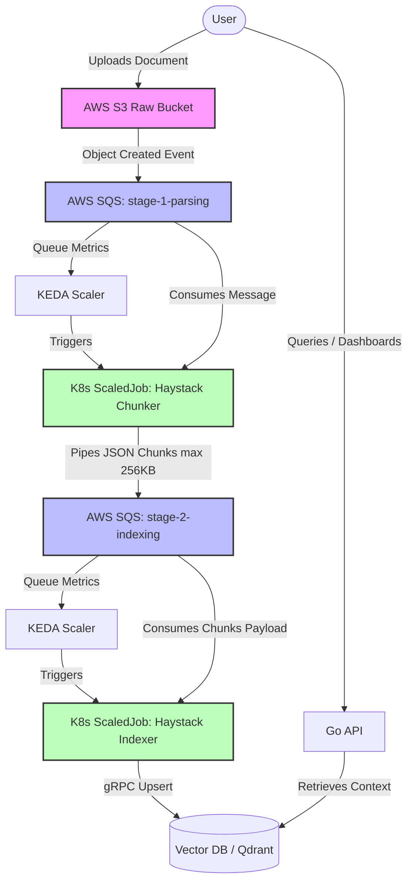

# 1. System Boundaries

Date: 2026-05-22

## Status

Accepted

## Context

Our RAG (Retrieval-Augmented Generation) pipeline requires a strict separation of concerns between heavy document processing and low-latency user querying. To leverage cost-efficient AWS Spot Instances without risking state corruption, the ingestion pipeline must be decoupled into independent, stateless, event-driven phases.

We have designed a Two-Stage Asynchronous Ingestion Pipeline where both processing phases are built on top of the Haystack framework and executed as ephemeral, short-lived Kubernetes Jobs managed by KEDA.

The updated interaction and boundaries map is shown below:

## Decision

We establish the following strict system boundaries and architectural rules:

1) Data Ingestion Entry Point (S3): AWS S3 acts as the decoupled, immutable entry point for raw documents. The system exposes no write-APIs for file uploads, isolating internal compute from external traffic spikes.

2) Stage 1 Processing Boundary (Haystack Chunker): Driven by KEDA ScaledJob tied to the stage-1-parsing SQS queue. This job downloads the raw file from S3, executes heavy parsing/text extraction, and slices it into semantic chunks using Haystack components.

   - Data Contract Transition: Instead of writing intermediate chunks back to S3 (which introduces expensive S3 API transaction costs), Stage 1 packs the array of text chunks and metadata directly into the JSON payload of the next queue (stage-2-indexing), keeping it strictly under the 256 KB SQS limit.

3) Stage 2 Processing Boundary (Haystack Indexer): Driven by KEDA ScaledJob tied to the stage-2-indexing SQS queue. This job takes the pre-calculated chunks directly from the SQS payload, fires them through the embedding component (via TEI), and pushes them into the Vector DB.

4) Query Boundary: A lightweight, synchronous, always-on Go API. It operates exclusively on the read path, interacting with the Vector DB for fast context retrieval.

5) Network & Resource Isolation: All components are deployed within an isolated Kubernetes Namespace. Cross-component traffic is tightly restricted at L4/L7 via Cilium Network Policies:

    - Chunker Job can only talk to S3 and SQS.

    - Indexer Job can only talk to SQS and Vector DB.

    - Go API can only talk to Vector DB (Read-Only).

## Consequences

- **100% Spot Resilience**: Since both processing phases run as native Kubernetes Jobs under a strict "Zero-Daemon" policy, the system is immune to sudden AWS Spot evictions. If a node drops mid-execution, the active SQS message naturally reappears in the queue after the Visibility Timeout expires and is processed fresh.

- **Zero Idle Compute Costs**: When there are no documents to process, both SQS queues are empty, and KEDA scales the number of running Chunker and Indexer jobs to absolute zero.

- **FinOps S3 Optimization**: Bypassing S3 for intermediate chunk storage completely eliminates S3 PUT/GET API request charges on large-scale document parsing.

- **Payload Constraints**: The Haystack Chunker (Stage 1) must guarantee that any batch of chunks sent to stage-2-indexing fits within the 256 KB SQS payload threshold. If a document yields a larger structure, the job must split the output across multiple SQS messages.

- **Database Idempotency Requirement**: Stage 2 (Indexer) MUST use deterministic point IDs for vector upserts (e.g., UUID5(file_name + chunk_index)). This ensures that if a Spot instance drops during the final database write, the retried job will overwrite the existing vectors rather than duplicating them.

- **Eventually Consistent Ingest**: Document availability for RAG querying is eventually consistent and depends on the total transit time through both SQS queues.
