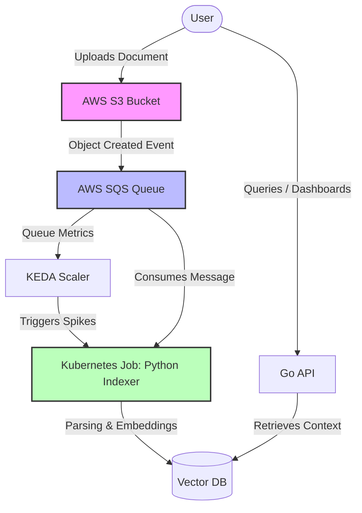

# 2. System Boundaries

Date: 2026-05-22

## Status

Accepted

## Context

Our RAG (Retrieval-Augmented Generation) pipeline requires a clear separation of concerns between document ingestion/processing and user querying. We need an architecture that scales dynamically with ingestion spikes while maintaining a highly available, low-latency API for querying. 

We have chosen an event-driven flow for indexing and a synchronous API for querying. The key interactions and components are mapped out below:

## Decision

We have decided to establish the following system boundaries:
1. **Ingestion Boundary**: Handled asynchronously via AWS S3 and SQS. This decouples the user upload action from the heavy processing tasks.
2. **Processing Boundary**: A short-lived Kubernetes Job (Python Indexer) triggered by KEDA based on SQS queue depth. This ensures a "Zero-Daemon" policy where compute resources are only consumed when documents are actively being processed.
3. **Query Boundary**: A lightweight, always-on Go API that interacts directly with the Vector Database for fast retrieval and user queries.

## Consequences

*   **Cost Efficiency**: We avoid paying for idle compute during periods of no document ingestion.
*   **Scalability**: The indexing pipeline can scale horizontally to handle massive influxes of documents (managed by KEDA and Kubernetes).
*   **Complexity**: Introduces asynchronous distributed systems complexity, requiring robust observability (e.g., handling Dead Letter Queues for failed indexing jobs).
*   **Latency**: Document availability in the Vector DB is eventually consistent rather than immediate.
