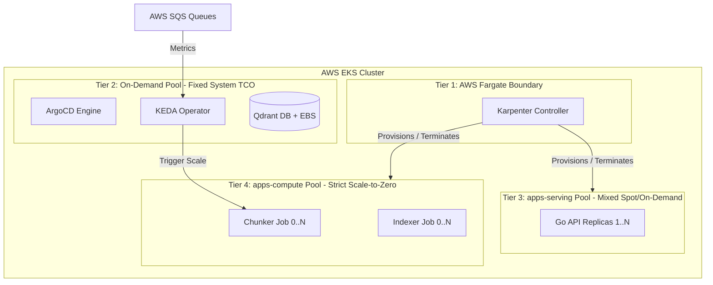

# ADR-0010: Kubernetes Compute Topography and Control Plane Isolation

Date: 2026-06-18

## Status

Accepted

## Context

As established in `ADR-0001`, the ingestion pipeline requires massive, unpredictable compute scaling that must minimize idle cluster costs (TCO) through AWS Spot instances and KEDA-driven lifecycle automation. However, running core infrastructure components—specifically the ArgoCD GitOps engine, the KEDA metrics adapter, and the Qdrant Vector Database—on volatile Spot compute introduces catastrophic risk of control-plane degradation, split-brain scheduling, and data corruption.

Furthermore, deploying user-facing query layers (`apps/api`) onto the same nodes as critical operational control engines induces a high risk of resource starvation (the "Noisy Neighbor" anti-pattern) during traffic spikes. We must define a multi-tiered compute architecture that isolates infrastructure orchestration, stateful storage, synchronous request serving, and asynchronous batch processing into distinct blast radiuses.

## Decision

We reject the paradigm of running a monolithic or non-segmented cluster node pool. Instead, we enforce a strict **4-Tier Compute Architecture** managed via Karpenter and native AWS EKS constructs:

1. **Bootstrap Isolation Layer (AWS Fargate Profile):**
   * The **Karpenter Controller** itself is explicitly deployed onto AWS Fargate. This establishes a structural guardrail that decouples the node provisioner from the EC2 lifecycles it manages, preventing deadlocks during scale-down and node consolidation events.

2. **Immutable Core Control Plane (On-Demand Managed Pool):**
   * Core operational daemons (**ArgoCD, KEDA, Cilium CNI**) along with the stateful database storage layer (**Qdrant Vector DB**) are restricted to a highly available, fixed-size pool of AWS On-Demand EC2 instances. No user-facing application workloads are permitted here.

3. **Isolated Synchronous Query Plane (`apps-serving` NodePool):**
   * A dedicated, isolated Karpenter NodePool is provisioned exclusively for `apps/api`. This tier allows a mixed allocation configuration (`capacity-type: ["on-demand", "spot"]`).
   * To ensure zero downtime and maintain predictable p95 latency targets (<200ms) during AWS Spot involuntary evictions, the Go API enforces a minimum of 2 replicas coupled with a strict `podAntiAffinity` policy forcing execution across distinct nodes.

4. **Ephemeral Computational Cluster (`apps-compute` NodePool):**
   * Asynchronous, heavy processing elements (**`apps/chunker` and `apps/indexer`**) are bound via strict taints and node selectors to an isolated pool of AWS Spot instances.
   * This pool is governed by a **Zero-Daemon Execution Enforcement** policy, configuring Karpenter to de-provision all associated nodes down to absolute zero within 30 seconds of SQS queue depletion.

## Consequences

* **Blast Radius Minimization & Anti-Noisy Neighbor:** An un-cached user query or heavy RRF reranking payload hitting `apps/api` cannot exhaust CPU/RAM resources required by ArgoCD, KEDA, or Qdrant, securing cluster stability.
* **Defensible FinOps Topography:** Premium On-Demand billing is bounded strictly to the essential core platform heartbeat and minimum SLA API availability. Highly unpredictable, resource-intensive ingestion operations (~85% of total cluster processing requirements) run exclusively on highly discounted Spot infrastructure.
* **Deadlock Mitigation:** Delegating Karpenter to an autonomous Fargate profile eliminates node eviction deadlocks during aggressive cluster consolidation phases.
* **Zero-Daemon Consistency Maintenance:** The data processing architecture complies fully with the dynamic scale-to-zero model outlined in `ADR-0001`. The computational node layer fully dissolves when the system is idle.
* **Stateful Protection:** Qdrant remains undisturbed by Spot disruption cycles, removing write-ahead log (WAL) replay overhead and preventing vector database index degradation.
