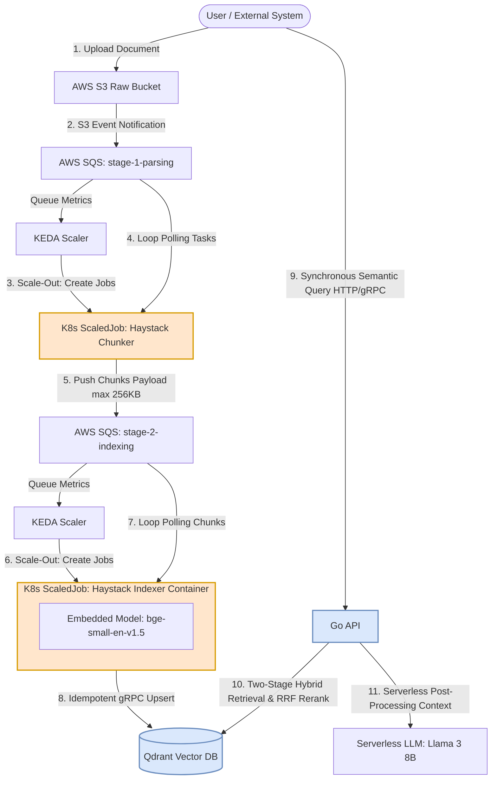

# Architecture Overview: simple-rag

This document describes the high-level architecture, component boundaries, and data flow in the `simple-rag` system. The system is designed as a fault-tolerant, cost-efficient pipeline for RAG, optimized for running on AWS Spot instances using the KEDA `ScaledJob` pattern with an internal self-terminating worker loop.

---

## 1. Architectural Principles and Assumptions

1. **Batch-Polling Ephemeral Jobs:** Data processing components (`chunker` and `indexer`) spawn as Kubernetes Jobs but operate an internal execution loop (`while True`). The container continues to poll and drain messages from SQS in a tight loop to amortize Python/Model startup costs. The Job self-terminating (`Exit 0`) only when the queue returns an empty response, ensuring zero idle compute costs.
2. **Scale-Out via KEDA:** KEDA manages horizontal scaling exclusively. If the message influx rate outpaces the processing throughput of active workers, KEDA provisions parallel Kubernetes Jobs (up to a strict `maxReplicaCount`) to assist in draining the SQS queue.
3. **Natural Scale-In:** Workload contraction is completely decentralized. KEDA does not forcefully evict active pods. As individual Jobs encounter an empty SQS queue sample, they break their internal processing loop and terminate cleanly. When idle, cluster resource consumption drops to absolute zero.
4. **Spot Resiliency & Idempotency:** Jobs run on cost-optimized AWS Spot Instances. Containers intercept the AWS 2-minute `SIGTERM` interruption notice, immediately halt SQS long-polling, complete the processing of the active inflight message, and exit gracefully. Data integrity is maintained via deterministic vector IDs (`UUID5`), guaranteeing that aborted-and-retried message blocks result in idempotent overwrites rather than vector duplication in Qdrant.
5. **FinOps Payload Passing:** Extracted text chunks are packed directly into the SQS message body (max 256 KB) between Stage 1 and Stage 2. S3 is used strictly for storing the initial source files, eliminating intermediate S3 API transaction costs and bucket polling overhead.

---

<h2 id="data-flow-diagram">2. Container and Data Flow Diagram</h2>

The definitive system architecture diagram is maintained here as the single source of truth:



---

## 3. Component Specification

### Asynchronous Ingestion Pipeline
* **AWS S3 Raw Bucket:** The decoupled ingestion interface. External applications drop source files here. A lifecycle policy transitions objects to Glacier Instant Retrieval after 7 days to slash storage costs while retaining on-demand access.
* **SQS Queue (stage-1-parsing):** Holds S3 Object Created event notifications containing only metadata (bucket name and object key).
* **Haystack Chunker (`apps/chunker`):** Ephemeral Python job. Downloads the document from S3, extracts text using specific strategies (PDF, TXT, Markdown), chunks the content, and pushes a structured JSON array to the next stage. Large documents are automatically split across multiple SQS messages to strictly fit within the 256 KB payload limit.
* **SQS Queue (stage-2-indexing):** High-throughput intermediate queue. The message payload explicitly contains the raw text chunks and parent metadata, bypassing the need for intermediate S3 storage.
* **Haystack Indexer (`apps/indexer`):** Ephemeral Python job. Operates under a strict 2GB RAM limit. It processes the SQS text chunks utilizing an **embedded** `bge-small-en-v1.5` model baked directly into its container image layer to eliminate network inference latency. Generates vectors locally and performs deterministic gRPC upserts to the VectorDB using `UUID5(file_name + chunk_index)`.

### Infrastructure and Storage Layer
* **KEDA (Ancillary Controller):** Handles event-driven scaling by querying SQS queue length. Spawns standard Kubernetes Jobs dynamically based on workload spikes.
* **Qdrant Vector DB:** Self-hosted distributed vector database running on persistent On-Demand compute nodes. Configured with native Dense (384-dim) and Sparse indexing to support low-latency gRPC semantic and keyword search.

### Synchronous Query Path
* **Go API (`apps/api`):** Ultra-lightweight service utilizing the Go approximation library or `go-chi`. Serves the static frontend asset and executes synchronous user search queries. Performs a **Two-Stage Hybrid Retrieval** (Dense + Sparse vector matching) against Qdrant, applies a custom word-count token dampening penalty algorithm to eliminate document spam, merges scores via **Reciprocal Rank Fusion (RRF)**, and passes pruned context to a serverless **Llama 3 8B** endpoint for final response generation.

---

## 4. Security and Network Isolation

1. **AWS Identity Security (IAM IRSA):** Hardcoded AWS credentials are strictly prohibited. Pods utilize a dedicated Kubernetes `ServiceAccount` bound to an AWS IAM Role via OpenID Connect (OIDC). `chunker` has read-only S3 access and read/write SQS access; `indexer` has exclusive read/delete access to `stage-2-indexing` SQS.
2. **Network Policies (Cilium):** Traffic inside the cluster mesh is enforced at L4/L7 boundaries:
    * `chunker` is restricted to outbound calls to AWS S3 and SQS.
    * `indexer` is restricted to outbound calls to AWS SQS and Qdrant gRPC ports.
    * `Go API` has inbound access from users, outbound gRPC access to Qdrant, and HTTPS access to the serverless LLM provider. Direct network access to S3 or SQS is explicitly blocked.

---

<h2 id="directory-structure">5. Repository Directory Structure</h2>

The monorepo follows a strict layout constraint. No arbitrary top-level directories are permitted:

```text
simple-rag/
├── apps/
│   ├── api/          # Go-based API (Lightweight query layer, Hybrid Retrieval + RRF Reranking)
│   ├── chunker/      # Python + Haystack (Stage 1: Ephemeral Kube Job for parsing & chunking)
│   └── indexer/      # Python + Haystack (Stage 2: Ephemeral Kube Job with baked-in bge-small model)
├── deploy/
│   └── k8s/          # Kubernetes manifests, KEDA ScaledJob and Cilium NetworkPolicies
├── docs/             # High-level system design and overview documentation
│   ├── adr/          # Architecture Decision Records log (Historical log)
│   ├── architecture.md  # Unified technical architecture deep-dive (This Document)
│   ├── contracts.md     # Ingestion schemas, SQS payloads and API specifications
│   └── ops.md           # Day-2 runbooks, cost metrics, and infrastructure scaling operations
└── terraform/
    ├── envs/prod/    # Environment entry point (invokes modules)
    └── modules/      # Reusable infrastructure blocks (vpc, eks, iam_irsa, s3, sqs)
```
