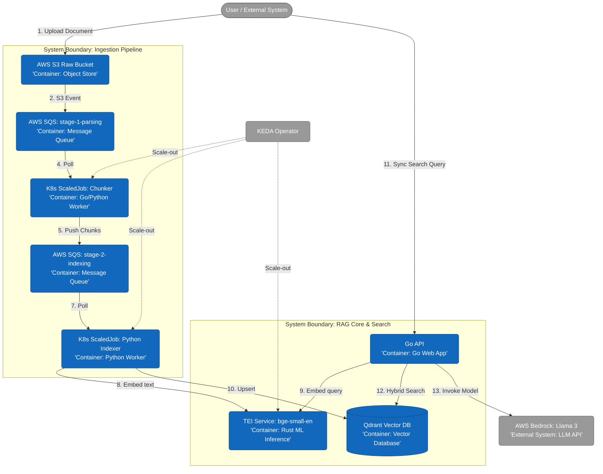

# Architecture Overview: simple-rag

This document describes the high-level architecture, component boundaries, and data flow in the `simple-rag` system. The system is designed as a fault-tolerant, cost-efficient pipeline for RAG, optimized for running on AWS Spot instances using the KEDA `ScaledJob` pattern with an internal self-terminating worker loop.

---

## 1. Architectural Principles and Lifecycle

1. **Ephemeral ScaledJobs with Internal Loop:** Processing components (`chunker` and `indexer`) are deployed exclusively as Kubernetes `Job` objects managed by KEDA (`ScaledJob`). They are **not** continuous daemons. To amortize heavy container cold-start and model initialization overhead, workers run an internal execution loop (`while True`). They continuously poll and drain SQS messages until the queue returns an empty response, at which point the application breaks the loop and exits with code 0.
2. **KEDA Scale-Out Boundary:** Horizontal scaling is managed top-down by KEDA based on SQS queue length metrics. KEDA provisions parallel Kubernetes Jobs up to a strict infrastructure quota (`maxReplicaCount`).
3. **Natural Scale-In (Decentralized):** Resource contraction happens naturally from within the application. KEDA does not forcefully evict or delete running jobs. When a specific worker detects an empty SQS sample, it terminates itself cleanly. Cluster resource utilization drops to absolute zero when idle.
4. **Spot Resiliency & SIGTERM Interception:** Compute workloads run on AWS Spot Instances. Containers must explicitly intercept the AWS 2-minute `SIGTERM` interruption signal. Upon receiving `SIGTERM`, the worker immediately halts SQS long-polling, completes the execution/ingestion of the active inflight payload batch, flushes state, and exits gracefully before hard eviction. Idempotency is guaranteed via deterministic vector IDs (`UUID5`), ensuring aborted-and-retried batches result in atomic overwrites in Qdrant rather than duplication.
5. **FinOps Payload Passing (ADR-0004):** Extracted text chunks are packed directly into the intermediate SQS message body (max 256 KB) between Stage 1 and Stage 2. AWS S3 is utilized strictly for the initial source file drop, eliminating intermediate S3 API transaction costs and state tracking overhead.

---

<h2 id="data-flow-diagram">2. Container and Data Flow Diagram</h2>

The definitive system architecture diagram is maintained here as the single source of truth:



---

## 3. Component Specification

### Asynchronous Ingestion Pipeline

* **AWS S3 Raw Bucket (`prod-raw-documents-eu-west-1`):** Decoupled ingestion interface. Operates under a **Trusted Ingress Assumption** (files uploaded via secure admin channels). Standard lifecycle policy transitions objects to Glacier Instant Retrieval after 7 days to minimize storage TCO.
* **SQS Queue (stage-1-parsing):** Standard SQS queue holding S3 Object Created metadata. Backed by `stage-1-parsing-dlq` for toxic payload isolation.
* **Haystack Chunker (`apps/chunker`):** Ephemeral Python job. Downloads files from S3.
    * **Compute-Layer Fail-Safe (ADR-0001):** Enforces a **Max File Size Limit of 100 MB**. Parses SQS metadata *before* downloading. If the file exceeds 100 MB, it drops the item, logs a structured alert, and routes to DLQ.
    * **Slicing:** Executes format-specific strategies (PDF, TXT, Markdown). Packs arrays into SQS Stage 2. If text chunks aggregate to >245 KB, it programmatically splits the chunks across multiple sequential SQS messages using a size-guard loop.
* **SQS Queue (stage-2-indexing):** High-throughput intermediate queue. Message payload contains raw text chunks. Backed by `stage-2-indexing-dlq`.
* **Haystack Indexer (`apps/indexer`):** Ephemeral Python job. Fetches chunk batches from SQS Stage 2, offloads vectorization to the standalone TEI service via HTTP/gRPC, and executes deterministic gRPC upserts to Qdrant using `UUID5(file_name + chunk_index)` to ensure idempotency. Bound to a hard resource limit of **2GB RAM**.

### Infrastructure and Storage Layer

* **KEDA (Kubernetes Event-driven Autoscaling):** Ancillary cluster controller that monitors SQS queue lengths and dynamically provisions standard Kubernetes `Job` workloads up to quota limits. It also dynamically scales the shared TEI Service based on queue/traffic metrics (`tei_queue_size`).
* **TEI Service (HuggingFace Text Embeddings Inference - ADR-0005):** Standalone, shared Kubernetes deployment running the Rust-based TEI container. It loads **`BAAI/bge-small-en-v1.5`** (130MB weights baked directly into the container storage layer via CI/CD) and exposes a private HTTP/gRPC endpoint (`EMBEDDING_MODEL_TEI_URL`) accessible by both the `indexer` and the `Go API`. It outputs **384-dimensional vectors** and scales horizontally via KEDA on `tei_queue_size`.
* **Qdrant Vector DB (ADR-0002):** Self-hosted distributed vector database running via Helm on persistent On-Demand compute nodes with AWS EBS (gp3) storage. Configured with native Dense (384-dim) and Sparse indexing. Uses single-stage filtering and Scalar Quantization (SQ) to reduce RAM consumption by ~75%.

### Synchronous Query Path

* **Go API (`apps/api`):** Minimalist service using `net/http` or `go-chi`. Serves static frontend assets and handles synchronous search queries (Target latency: p95 < 200ms).
* **Stage 1: Hybrid Retrieval:** Executes synchronized hybrid query against Qdrant (Dense Vector Index + Sparse Vector Index for BM25-like matching).
* **Word Count Match & Penalty Algorithm (ADR-0006):** Applies a deterministic token-frequency penalty algorithm to prevent keyword stuffing:
    * $$Score_{final} = Score_{raw} \times \frac{1}{\log_{10}(TermCount + 10)}$$
* **Stage 2: Semantic Reranking (RRF):** Merges dense and sparse result sets using **Reciprocal Rank Fusion (RRF)** with constant $k=60$ directly on CPU.
* **Context Pruning (ADR-0007):** Formats payload into a compact JSON string, stripping all non-essential metadata before passing it to the LLM to slash token costs.
* **Stage 3: Serverless Response Synthesis:** Invokes AWS Bedrock via native Go SDK v2. The request is bound within the private VPC boundary via an AWS Bedrock VPC Endpoint, passing the pruned context to Meta Llama 3.1 (8B Instruct) on an On-Demand pay-per-token billing layout.

---

## 4. Security and Network Isolation

1. **Identity Security (IAM IRSA):** Zero hardcoded credentials. Pods utilize dedicated Kubernetes `ServiceAccounts` mapped to AWS IAM Roles via OIDC. `chunker` has read-only S3 access and read/write SQS access. `indexer` has exclusive read/delete access to SQS Stage 2. `apps/api` has an IAM policy granting `bedrock:InvokeModel` strictly for `us.meta.llama3-1-8b-instruct-v1:0`.
2. **Network Topology (Cilium NetworkPolicies):**
    * `chunker`: Outbound allowed only to AWS S3, SQS, and internal CoreDNS.
    * `indexer`: Outbound allowed only to AWS SQS, Qdrant gRPC, and the shared TEI Service endpoint. Direct egress to the internet is denied.
    * `Go API`: Inbound allowed from ingress/users. Outbound allowed strictly to Qdrant cluster gRPC/HTTP ports, the shared TEI Service endpoint, and the internal IP addresses of the AWS Bedrock VPC Interface Endpoint. Public internet access is denied at the network policy layer.

---

<h2 id="directory-structure">5. Repository Directory Structure</h2>

The monorepo follows a strict layout constraint. No arbitrary top-level directories are permitted:

```text
simple-rag/
├── apps/
│   ├── api/          # Go-based API (Lightweight query layer, Hybrid Retrieval + RRF Reranking + Bedrock SDK)
│   ├── chunker/      # Python + Haystack (Stage 1: Ephemeral Kube Job for parsing & chunking)
│   └── indexer/      # Python + Haystack (Stage 2: Ephemeral Kube Job calling shared TEI service)
├── deploy/
│   └── k8s/          # Kubernetes manifests, KEDA ScaledJob and Cilium NetworkPolicies
├── docs/             # High-level system design and overview documentation
│   ├── adr/          # Architecture Decision Records log (Historical log)
│   ├── architecture.md  # Unified technical architecture deep-dive (This Document)
│   ├── contracts.md     # Ingestion schemas, SQS payloads and API specifications
│   └── ops.md           # Day-2 runbooks, cost metrics, and infrastructure scaling operations
└── terraform/
    ├── envs/prod/    # Environment entry point (invokes modules)
    ├── modules/      # Reusable infrastructure blocks (vpc, eks, iam_irsa, s3, sqs, vpc_endpoints)
    └── test_local/   # Standalone S3/SQS deployment for local ingestion testing (AWS Native)
```
