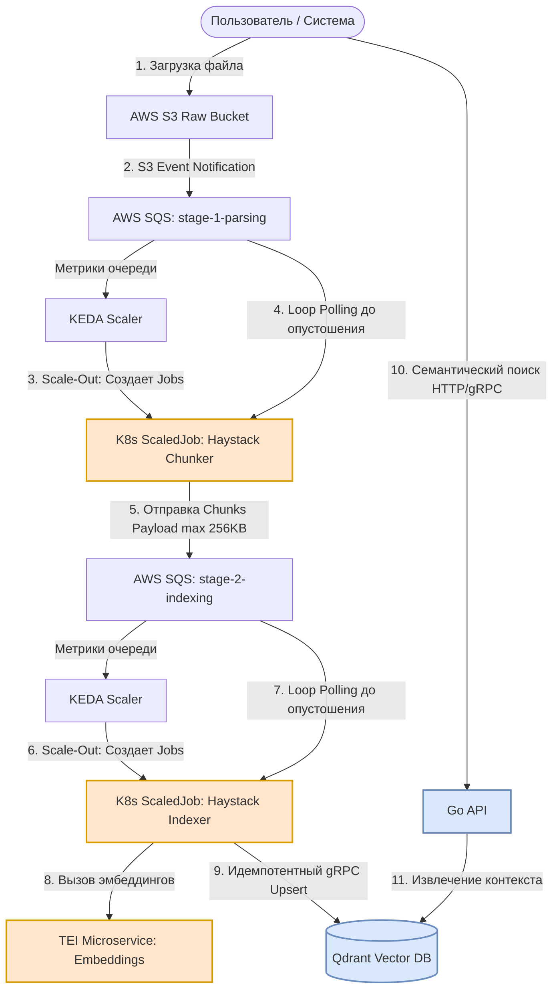

# Architecture Overview: simple-rag

This document describes the high-level architecture, component boundaries, and data flow in the `simple-rag` system. The system is designed as a fault-tolerant pipeline for RAG, optimized for running on AWS Spot instances using the KEDA `ScaledJob` pattern with an internal self-terminating loop.

## 1. Architectural Principles and Assumptions

1. **Long-Running ScaledJobs:** Data processing components (`chunker` and `indexer`) run as Kubernetes Jobs. A continuous loop (`while True`) runs inside the container, polling for messages from SQS. Jobs terminate their work (`Exit 0`) automatically and only when the queue is completely empty.
2. **Scale-Out via KEDA:** KEDA manages scale-out only. If the message influx rate exceeds the processing rate, KEDA spawns new parallel Kubernetes Jobs (up to `maxReplicaCount`).
3. **Natural Scale-In:** System shutdown management is completely decentralized. KEDA does not kill pods. As soon as jobs complete, workers one by one commit an empty response from SQS, break out of the loop, and terminate. When idle, the system consumes 0 resources.
4. **Spot Resiliency:** Since a job can run for a long time, it must intercept the `SIGTERM` signal from AWS Spot (a two-minute warning), stop reading new messages, complete processing the current inflight message, and exit gracefully. 5. **FinOps Payload Passing:** Text chunks are passed directly via SQS message bodies (max. 256 KB) between stages 1 and 2. S3 is used only for source file storage.

---

## 2. Container and Data Flow Diagram

## 3. Component Specification
Asynchronous Ingestion Pipeline
- AWS S3 Raw Bucket: Entry point for documents. Lifecycle Policy configured: after 7 days, files are moved to the Glacier Instant Retrieval class to minimize storage costs while maintaining instant access on demand.
- SQS stage-1-parsing: A queue storing triggers from S3 (contains only the bucket name and file key).
- Haystack Chunker (apps/chunker): A Python application based on Haystack. Downloads a file, extracts text (PDF, TXT, Markdown), and cuts it into chunks. It generates a JSON array of chunks with metadata and sends it to the next queue. If the JSON size is > 256 KB, it is cut into multiple messages.
- SQS stage-2-indexing: A queue whose payload (body) contains actual text chunks.
- Haystack Indexer (apps/indexer): A Python application. It takes chunks from the SQS body, sends them in batches to TEI to generate vectors, and performs a deterministic database upload. UUID5(file_name + chunk_index) is used to generate vector IDs.

Infrastructure Services (Compute & Storage)
- KEDA (Kubernetes Event-Driven Autoscaling): A controller that polls SQS queue depth via the CloudWatch/AWS API. For every N messages, it spawns a standard Kubernetes Job for the Chunker or Indexer (within the maxReplicaCount limits).
- TEI (Text Embeddings Inference): A high-performance server from HuggingFace for embedding inference (runs in a cluster and scales depending on load).
- Qdrant Vector DB: A distributed vector database. Stores vectors and chunk metadata. Uses gRPC for fast insertion and search.

Synchronous Query Path
- Go API (apps/api): An ultra-lightweight and fast service written in Go (net/http or go-chi). Responsible for rendering the interface (Vanilla JS) and processing user search queries. Makes Read-Only gRPC requests to Qdrant to find relevant chunks of text based on the request vector.

## 4. Security and Network Isolation
1. AWS Security (IAM IRSA): None component does not contain hardcoded AWS keys. Chunker and Indexer pods use a Kubernetes ServiceAccount linked via OIDC to an AWS IAM Role (IAM Roles for Service Accounts). Chunker has read-only access to S3 and read/write access to SQS. Indexer has read-only access to SQS.

2. Network Policies (Cilium Network Policies): Network traffic within the cluster is restricted at L4/L7 levels:
- Chunker can only initiate connections to external AWS APIs (S3, SQS).
- Indexer can only communicate with AWS SQS, TEI, and Qdrant.
- Go API has access only to Qdrant (gRPC port) and externally to the user. Direct access from the Go API to SQS or S3 is blocked.
