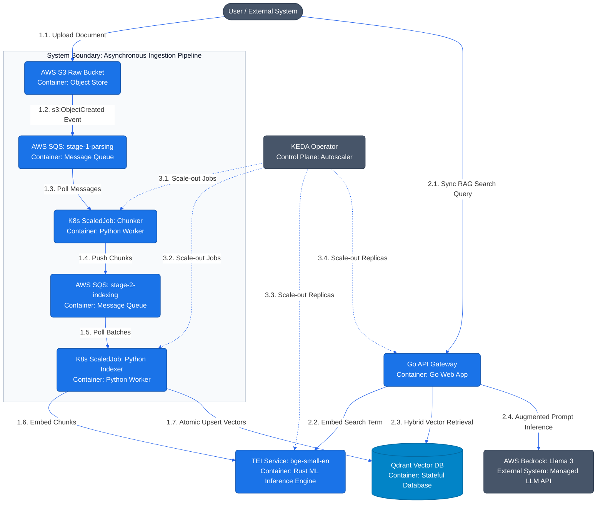

# Architecture Overview: simple-rag

This document describes the high-level architecture, component boundaries, and data flow in the `simple-rag` system. The system is designed as a fault-tolerant, cost-efficient pipeline for RAG, optimized for running on AWS Spot instances using the KEDA `ScaledJob` pattern with an internal self-terminating worker loop.

---

## 1. Architectural Principles and Lifecycle

1. **Ephemeral ScaledJobs with Internal Loop:** Processing components (`chunker` and `indexer`) are deployed exclusively as Kubernetes `Job` objects managed by KEDA (`ScaledJob`). They are **not** continuous daemons. To amortize heavy container cold-start and model initialization overhead, workers run an internal execution loop (`while True`). They continuously poll and drain SQS messages until the queue returns an empty response, at which point the application breaks the loop and exits with code 0.
2. **KEDA Scale-Out Boundary:** Horizontal scaling is managed top-down by KEDA based on SQS queue length metrics. KEDA provisions parallel Kubernetes Jobs up to a strict infrastructure quota (`maxReplicaCount`).
3. **Natural Scale-In (Decentralized):** Resource contraction happens naturally from within the application. KEDA does not forcefully evict or delete running jobs. When a specific worker detects an empty SQS sample, it terminates itself cleanly. Cluster resource utilization drops to absolute zero when idle.
4. **Spot Resiliency & SIGTERM Interception:** Compute workloads run on AWS Spot Instances. Containers must explicitly intercept the AWS 2-minute `SIGTERM` interruption signal. Upon receiving `SIGTERM`, the worker immediately halts SQS long-polling, completes the execution/ingestion of the active inflight payload batch, flushes state, and exits gracefully before hard eviction. Idempotency is guaranteed via deterministic vector IDs (`UUID5`), ensuring aborted-and-retried batches result in atomic overwrites in Qdrant rather than duplication.
5. **FinOps Payload Passing (ADR-0004):** Extracted text chunks are packed directly into the intermediate SQS message body (max 256 KB) between Stage 1 and Stage 2. AWS S3 is utilized strictly for the initial source file drop, eliminating intermediate S3 API transaction costs and state tracking overhead.

---

## 2. Infrastructure Demarcation & Control Planes

The platform enforces a strict boundary of engineering responsibility between environment provisioning (Terraform) and in-cluster GitOps state enforcement (ArgoCD) to guarantee high availability and prevent resource deadlocks:

### Layer 1: Foundations Layer (Managed by Terraform)
* **eBPF Networking & Edge Gateway (Cilium):** Provisioned immediately alongside EKS. Operates natively with Kubernetes Gateway API CRDs (`gateway.networking.k8s.io`) to manage edge routing, replacing deprecated reverse-proxy architectures.
* **Orchestration & Node Provisioning (Karpenter):** Bootstrap is isolated onto an AWS Fargate profile. Manages automatic creation, caching, and teardown of EC2 On-Demand and Spot NodePool configurations.
* **Storage Provider (AWS EBS CSI Driver):** Injected natively to interface directly with the AWS EC2 storage fabric, enabling declarative persistent disk attachment.
* **GitOps Engine (ArgoCD):** Bootstrapped via a single Helm transaction to monitor the `deploy/k8s/environments/local` (or `prod`) repository scope.

### Layer 2: Configuration Layer (Managed by ArgoCD App-of-Apps)
* **Platform Controllers:** KEDA autoscaling operators, log routers, and telemetry systems.
* **L7 Traffic Topography:** Declarative `Gateway` allocations and `HTTPRoute` definitions evaluated via Cilium's eBPF ingress layer.
* **Workload Configurations:** Stateful entities (Qdrant Vector DB instance bounds) and processing execution layers (`apps/`).

---

<h2 id="data-flow-diagram">3. Container and Data Flow Diagram</h2>

The definitive system architecture diagram is maintained here as the single source of truth:


```mermaid
graph TB
    %%{init: {
      'theme': 'base', 
      'themeVariables': { 
        'darkMode': false,
        'background': 'transparent',
        'lineColor': '#2563eb',
        'edgeLabelBackground':'#ffffff',
        'nodeBorder': '#2563eb',
        'clusterBkg': '#f8fafc',
        'clusterBorder': '#94a3b8',
        'titleColor': '#0f172a'
      }
    }}%%

    %% Class definitions
    classDef container fill:#1a73e8,stroke:#1557b0,color:#ffffff,rx:6px,stroke-width:1.5px;
    classDef external fill:#475569,stroke:#334155,color:#ffffff,rx:6px,stroke-width:1.5px;
    classDef database fill:#0284c7,stroke:#0369a1,color:#ffffff,rx:6px,stroke-width:1.5px;

    %% External Entities
    User([User / External System]):::external
    Bedrock[AWS Bedrock: Llama 3<br/>External System: Managed LLM API]:::external
    KEDA[KEDA Operator<br/>Control Plane: Autoscaler]:::external

    %% Core Application Components
    GoAPI[Go API Gateway<br/>Container: Go Web App]:::container
    TEI[TEI Service: bge-small-en<br/>Container: Rust ML Inference Engine]:::container
    Qdrant[(Qdrant Vector DB<br/>Container: Stateful Database)]:::database

    %% COMPOSITE SYSTEM BOUNDARY: Ingestion Pipeline
    subgraph Ingestion_Pipeline [System Boundary: Asynchronous Ingestion Pipeline]
        S3[AWS S3 Raw Bucket<br/>Container: Object Store]:::container
        SQS1[AWS SQS: stage-1-parsing<br/>Container: Message Queue]:::container
        Job1[K8s ScaledJob: Chunker<br/>Container: Python Worker]:::container
        SQS2[AWS SQS: stage-2-indexing<br/>Container: Message Queue]:::container
        Indexer[K8s ScaledJob: Python Indexer<br/>Container: Python Worker]:::container

        S3 -->|1.2. s3:ObjectCreated Event| SQS1
        SQS1 -->|1.3. Poll Messages| Job1
        Job1 -->|1.4. Push Chunks| SQS2
        SQS2 -->|1.5. Poll Batches| Indexer
    end

    %% External Ingress Flows
    User -->|1.1. Upload Document| S3
    User -->|2.1. Sync RAG Search Query| GoAPI

    %% Async Ingestion Processing Flows
    Indexer -->|1.6. Embed Chunks| TEI
    Indexer -->|1.7. Atomic Upsert Vectors| Qdrant

    %% Sync Query Processing Flows
    GoAPI -->|2.2. Embed Search Term| TEI
    GoAPI -->|2.3. Hybrid Vector Retrieval| Qdrant
    GoAPI -->|2.4. Augmented Prompt Inference| Bedrock

    %% Control Plane Scaling Relationships
    KEDA -.->|3.1. Scale-out Jobs| Job1
    KEDA -.->|3.2. Scale-out Jobs| Indexer
    KEDA -.->|3.3. Scale-out Replicas| TEI
    KEDA -.->|3.4. Scale-out Replicas| GoAPI
```

---

<h2 id="component-specification">4. Component Specification</h2>

### Asynchronous Ingestion Pipeline

* **AWS S3 Raw Bucket:** Decoupled ingestion interface. Operates under a Trusted Ingress Assumption. Standard lifecycle policy transitions objects to Glacier Instant Retrieval after 7 days.
* **SQS Queue (stage-1-parsing):** Standard SQS queue holding S3 Object Created metadata. Backed by `stage-1-parsing-dlq`.
* **Haystack Chunker (`apps/chunker`):** Ephemeral Python job.
    * **Compute-Layer Fail-Safe (ADR-0001):** Enforces a Max File Size Limit of 100 MB. Parses SQS metadata before downloading; oversized payloads are routed directly to DLQ.
    * **FinOps Payload Packing (ADR-0004):** Enforces a 350-token limit per text chunk (~1.5–2 KB). Caps message batching at 30 chunks per payload (~60 KB) to guarantee 100% of SQS messages stay under the 64 KB AWS billing threshold, avoiding multi-chunk transaction charges.
* **SQS Queue (stage-2-indexing):** High-throughput intermediate queue. Backed by `stage-2-indexing-dlq`. Message payload contains structured JSON batches (~60 KB).
* **Haystack Indexer (`apps/indexer`):** Ephemeral Python job. Fetches chunk batches from SQS Stage 2, offloads vectorization to the standalone TEI service. Executes deterministic gRPC upserts to Qdrant using `UUID5(file_name + chunk_index)`. Bound to a hard resource limit of 2GB RAM.

### Infrastructure and Storage Layer

* **KEDA (Kubernetes Event-driven Autoscaling):** Monitors SQS queue lengths natively and dynamically provisions standard Kubernetes `Job` workloads up to quota limits.
* **TEI Service (HuggingFace Text Embeddings Inference - ADR-0005):** Standalone, shared Kubernetes deployment running the Rust-based TEI container. Loads `BAAI/bge-small-en-v1.5`. Exposes a private HTTP/gRPC endpoint accessible by both the indexer and the Go API. Outputs 384-dimensional vectors.
* **Qdrant Vector DB (ADR-0002):** Self-hosted distributed vector database running via Helm on persistent On-Demand compute nodes with AWS EBS (gp3). Uses single-stage filtering and Scalar Quantization (SQ) to reduce RAM consumption by ~75%. Configured with native Payload Text Indexing (`FieldTypeText`) for deterministic alphanumeric lookup.

### Synchronous Query Path

* **Go API (`apps/api`):** Serves static frontend assets and handles synchronous search queries (Target latency: p95 < 200ms).
* **Stage 1: Single-Roundtrip Native Retrieval:** Executes a single gRPC `PrefetchQuery` combining Dense Vector Index (semantic), Sparse Vector Index (SPLADE), and Payload Text Index (exact keyword matches).
* **Stage 2: Database-Native RRF Reranking:** Delegated hybrid retrieval and rank merging natively to Qdrant using gRPC `NewQueryRRF` with constant $k=60$. Eliminates client-side CPU normalization and excessive network payload serialization overhead.
* **Stage 3: Context Pruning & LLM (ADR-0007):** Strips all non-essential metadata before passing it to the LLM to slash token costs. Invokes AWS Bedrock via native Go SDK v2. The request is bound within the private VPC boundary via an AWS Bedrock VPC Endpoint, passing the pruned context to Meta Llama 3.1 (8B Instruct).
---

## 5. Security and Network Isolation

1. **Identity Security (EKS Pod Identity & IRSA):** Zero hardcoded credentials. The platform primarily leverages the newer **EKS Pod Identity** approach for mapping AWS IAM Roles to Kubernetes workloads. **IAM IRSA (OIDC)** is utilized exclusively for Karpenter, as it runs on AWS Fargate where Pod Identities are not supported. `chunker` has read-only S3 access and read/write SQS access. `indexer` has exclusive read/delete access to SQS Stage 2. `apps/api` has an IAM policy granting `bedrock:InvokeModel` strictly for `us.meta.llama3-1-8b-instruct-v1:0`.
2. **Network Topology (Cilium NetworkPolicies):**
    * `chunker`: Outbound allowed only to AWS S3, SQS, and internal CoreDNS.
    * `indexer`: Outbound allowed only to AWS SQS, Qdrant gRPC, the shared TEI Service endpoint, and specific internet domains (e.g., `huggingface.co`, `hf.co`) required for dynamic model downloading.
    * `Go API`: Inbound allowed from Cilium Gateway API endpoints. Outbound allowed strictly to Qdrant cluster gRPC/HTTP ports, the shared TEI Service endpoint, and the internal IP addresses of the AWS Bedrock VPC Interface Endpoint. Public internet access is denied at the network policy layer.

---

<h2 id="directory-structure">6. Repository Directory Structure</h2>

The monorepo follows a strict layout constraint. No arbitrary top-level directories are permitted:

```text
simple-rag/
├── apps/
│   ├── api/          # Go-based API (Lightweight query layer, Hybrid Retrieval + RRF Reranking + Bedrock SDK)
│   ├── chunker/      # Python + Haystack (Stage 1: Ephemeral Kube Job for parsing & chunking)
│   └── indexer/      # Python + Haystack (Stage 2: Ephemeral Kube Job calling shared TEI service)
├── deploy/
│   └── k8s/          # Kubernetes manifests, KEDA ScaledJob and Cilium NetworkPolicies
├── docs/             # High-level system design and overview documentation
│   ├── adr/          # Architecture Decision Records log (Historical log)
│   ├── architecture.md  # Unified technical architecture deep-dive (This Document)
│   ├── contracts.md     # Ingestion schemas, SQS payloads and API specifications
│   └── ops.md           # Day-2 runbooks, cost metrics, and infrastructure scaling operations
└── terraform/
    ├── envs/prod/    # Environment entry point (invokes modules)
    ├── modules/      # Reusable infrastructure blocks (vpc, eks, iam_irsa, s3, sqs, vpc_endpoints)
    └── test_local/   # Standalone S3/SQS deployment for local ingestion testing (AWS Native)
```
